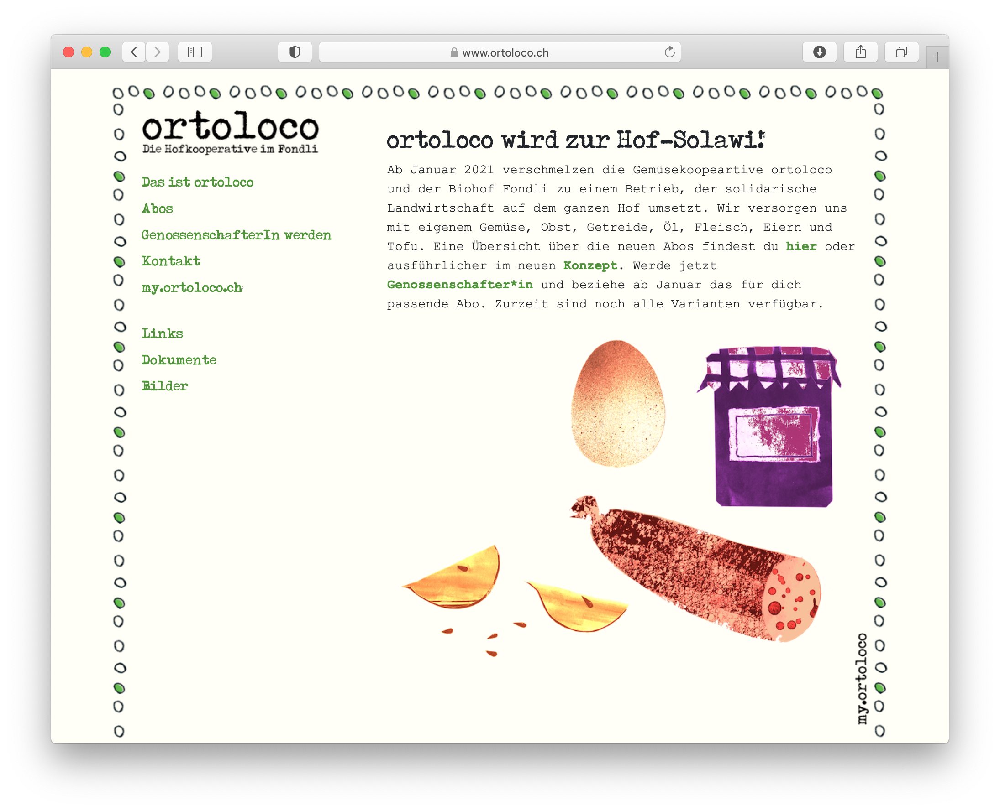

# ortoloco Classic

ortoloco Classic theme is a [Grav](http://github.com/getgrav/grav) theme based on version 4 of the popular [Bootstrap framework](http://getbootstrap.com/) and represents the traditional ortoloco Böhnli theme.

# Installation

Installing the ortoloco Classic theme can be done in one of two ways. Our GPM (Grav Package Manager) installation method enables you to quickly and easily install the theme with a simple terminal command, while the manual method enables you to do so via a zip file.

## GPM Installation (Preferred)

The simplest way to install this theme is via the [Grav Package Manager (GPM)](http://learn.getgrav.org/advanced/grav-gpm) through your system's Terminal (also called the command line).  From the root of your Grav install type:

    bin/gpm install ortoloco-classic

This will install the ortoloco Classic theme into your `/user/themes` directory within Grav. Its files can be found under `/your/site/grav/user/themes/ortoloco-classic`.

## Manual Installation

To install this theme, just download the zip version of this repository and unzip it under `/your/site/grav/user/themes`. Then, rename the folder to `ortoloco-classic`. You can find these files either on [GitHub](https://github.com/ortoloco/grav-theme-ortoloco-classic).

You should now have all the theme files under

    /your/site/grav/user/themes/ortoloco-classic

>> NOTE: This theme is a modular component for Grav which requires the [Grav](http://github.com/getgrav/grav), [Error](https://github.com/getgrav/grav-theme-error) and [Problems](https://github.com/getgrav/grav-plugin-problems) plugins.

## Dependencies

The ortoloco Classic theme now depends on the [Bootstrapper plugin](https://github.com/getgrav/grav-plugin-bootstrapper) to provide the appropriate CSS and JS.  If you install via GPM, you should be prompted to also install this plugin.  If not you should manually install via:

    bin/gpm install bootstrapper

# Setup

If you want to set ortoloco Classic as the default theme, you can do so by following these steps:

* Navigate to `/your/site/grav/user/config`.
* Open the **system.yaml** file.
* Change the `theme:` setting to `theme: ortoloco-classic`.
* Save your changes.
* Clear the Grav cache. The simplest way to do this is by going to the root Grav directory in Terminal and typing `bin/grav clear-cache`.

Once this is done, you should be able to see the new theme on the frontend. Keep in mind any customizations made to the previous theme will not be reflected as all of the theme and templating information is now being pulled from the **ortoloco-classic** folder.